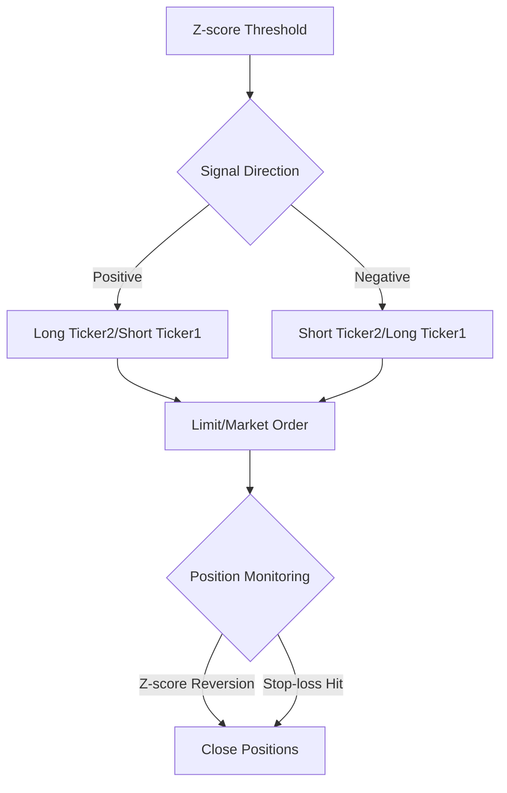

# Statistical Arbitrage Trading Bot (Prototype)


## Overview

This repository contains a prototype implementation of a 24/7 statistical arbitrage trading bot using a mean-reversion strategy based on cointegration and z-score thresholds. The system is designed for single pair trading with basic risk management capabilities, serving as an educational foundation for statistical arbitrage concepts.

**Key Differentiator**: While this prototype uses basic statistical methods, the developer is currently live-forward-testing a significantly more sophisticated version incorporating ensemble machine learning models (XGBoost, PPO), advanced statistical methods (Copulas, Heston Model), and robust risk management techniques.

## Features

### **Core Strategy**
- Cointegration-based pair selection  
- Z-score threshold triggering (entry/exit)  
- Basic mean-reversion logic  
- 24/7 market monitoring  

### **Execution Features**
- ByBit API integration (Testnet/Mainnet)  
- Dual order management (Limit/Market)  
- Position auto-balancing  
- Emergency kill switch  

### **Risk Management**
- Fixed percentage stop-loss  
- Position size calibration  
- Order book liquidity analysis  
- Spread monitoring  

## Configuration

### **Obtain ByBit API keys**
1. Create API keys from the ByBit exchange (Testnet recommended for practice).  
2. Store API keys securely.

### **Update `config_execution_api.py`**
- Set `testnet = False` for live trading  
- Input API keys  
- Configure pair parameters(to be changed according to your requirements):  

```python
# Asset pair configuration
ticker_1 = "BCHUSDT"  # Replace with your first asset
ticker_2 = "XNOUSDT"  # Replace with cointegrated pair
signal_trigger_thresh = 2.5  # Z-score threshold
stop_loss_fail_safe = 0.08  # 8% stop-loss
```

## Strategy Details

### **Cointegration Framework**
- Historical spread analysis using ADF test  
- Hedge ratio calculation via OLS regression  
- Rolling z-score computation (21-period window)  

### **Trading Signals**
| Condition          | Action             |
|-------------------|--------------------|
| Z-score > +2.5   | Short spread       |
| Z-score < -2.5   | Long spread        |
| Z-score crosses zero | Close position |
| 8% Adverse Move  | Stop-loss triggered |

### **Order Execution Logic**


## Advanced Version Preview (Under Development)

While this prototype uses basic statistical arbitrage concepts, the production-grade system in development employs:

### **Enhanced Signal Generation**
- Ensemble modeling with XGBoost and PPO  
- Copula-based dependency analysis  
- Monte Carlo stress testing  
- Heston model volatility surfaces  

### **Sophisticated Risk Management**
- Kelly Criterion position sizing  
- PCA-based feature selection  
- Cluster-based pair selection (K-means)  
- Automated liquidity scoring  

### **Operational Improvements**
- 30-minute batch processing  
- Multi-exchange compatibility  
- Dockerized deployment  
- MLflow experiment tracking  

## **Important Notes**
- **This is a prototype - Not recommended for live trading**  
- **Paper trading strongly advised**  
- **Requires customization for specific pairs**  
- **No warranty provided - Use at your own risk**  

### **Risk Factors & Mitigation Strategies**
| Risk Factor             | Mitigation Strategy          |
|------------------------|-----------------------------|
| Cointegration Breakdown | Regular re-testing         |
| Execution Slippage      | Liquidity requirements     |
| Black Swan Events      | Daily position capping     |
| Model Drift            | Weekly retraining schedule |

## Contributions
Contributions are welcome for:
- Enhanced risk management modules  
- Alternative cointegration tests  
- Portfolio optimization extensions  
- Machine learning integrations  

## Acknowledgments
Special thanks to **Shaun McDonogh** for sharing his knowledge through Udemy, which greatly contributed to the development of this strategy.

## Disclaimer
This software is for **educational purposes only**. Past performance is not indicative of future results. The developers assume **no liability** for any trading losses incurred.

## License
**MIT License**


